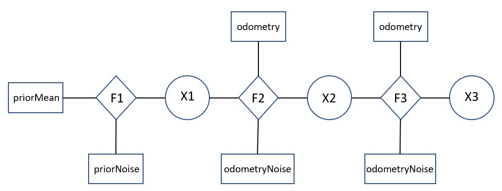
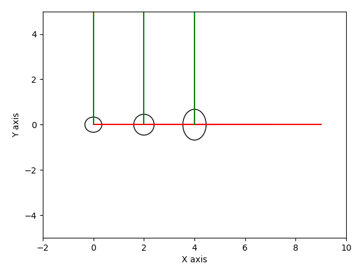
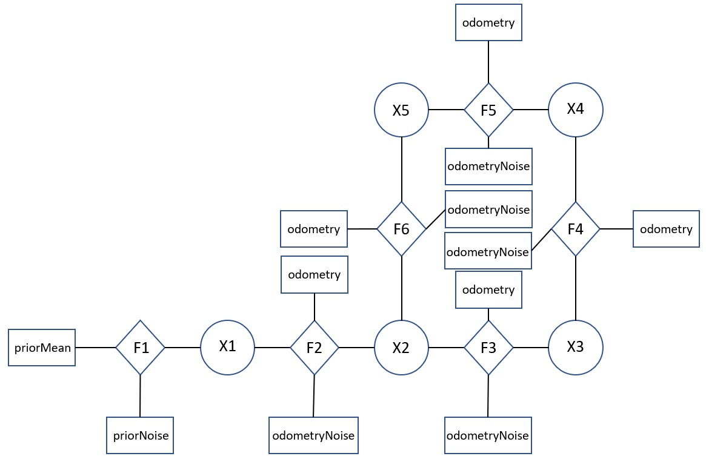
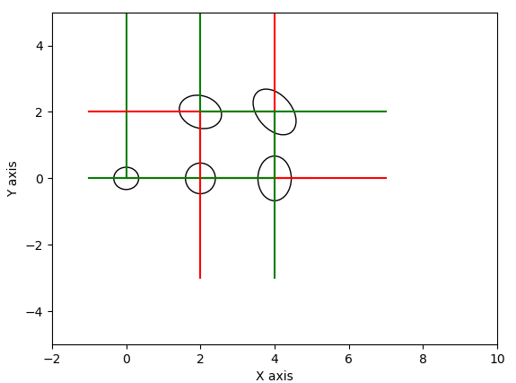
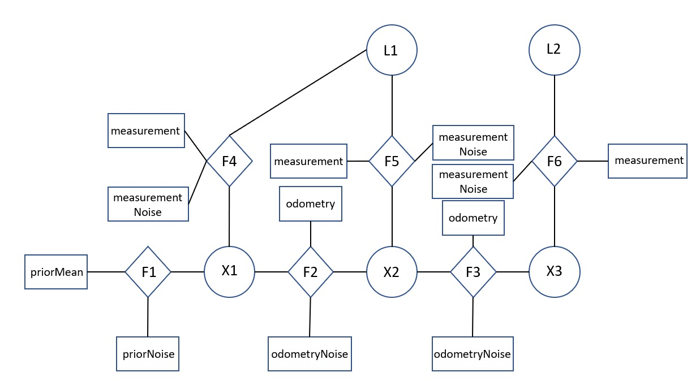
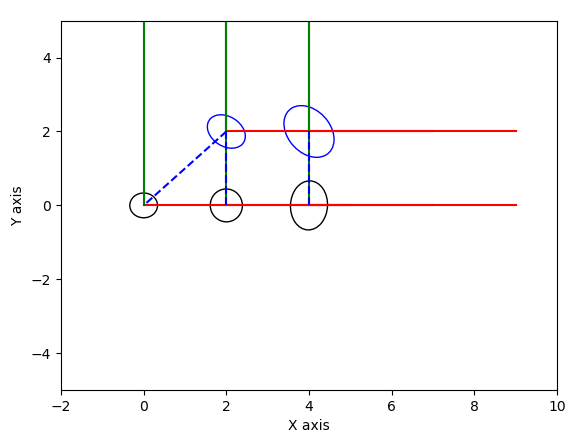

* Factor graphs are graphical models that are used to represent and optimize complex non-linear tasks such as SLAM.
* The graphical model is formed of factor nodes and variable nodes. The variable nodes are the unknowns which needs to estimated and factor nodes are used to represent the prior probability or the probabilistic constraints of the measurements(either motion or observation) between variable nodes.
* GTSAM(Georgia Tech Smoothing and Mapping) is a library that exploits the sparse connections in the graphical model to compute the variables efficiently.
* In factor graph, the factors could be seen as the conditional probability in a bayes network. To maximize the posterior probability, is to maximize the product of these factors. Thus we are performing a maximum a-posteriori (MAP) inference.

<b>Figure 1 - Basic factor graph</b>

* The above figure 1 shows a simple factor graph where X1, X2 And X3 represents the poses that are to be estimated. These are represented by variable nodes.
* There are also 3 factors F1, F2, F3 assosciated with the graph. F1 represents the prior knowledge of the pose of the robot. F2 And F3 incoporate the odometry measurements between poses X1 - X2 and X2 - X3 respectively.
* There are also 2 noise models here. The priorNoise which acts on the prior knowledge and odometryNoise assosciated with the odometry measurements.

<b>Figure 2 - Basic factor graph - estimated poses with uncertainty covariance ellipses</b>

* The above figure 2 plots the estimated poses with the uncertainty covariances as ellipse. It can be seen that as the number of actions or motion the system makes, the uncertainty ellipse continues to grow.
* some of the important gtsam functions used here are:

* gtsam.symbol('x',1) - to generate a symbol x1 to be used in the graph.
* gtsam.NonlinearFactorGraph() - to generate a non linear graph object
* gtsam.Pose2(x, y, theta) - to create a 2D pose with x, y, theta
* gtsam.noiseModel.Diagonal.Sigmas(np.array([std-x, std-y, std-theta], dtype=np.float64)) - to create a noise model matrix
* graph.add(gtsam.PriorFactorPose2(1, priorMean, priorNoise)) - To add the prior knowledge factor of the initial pose of the robot along with the assosciated priorNoise.
* graph.add(gtsam.BetweenFactorPose2(1, 2, odometry, odometryNoise)) - to add the odometry measurement factor between two poses 1 and 2 with the odometry value and the assosciated odometryNoise.
* gtsam.Values() - The solution of the graph is not stored in the factor class graph. Instead a Values type is initialized with the inaccurate variable/unkown value and the graph optimizes on it.
* gtsam.LevenbergMarquardtOptimizer(graph, initial: gtsam.Values()).optimize() - Non-linear graph is used due to the fact that non-linearity exists in odometry due to the orientation of the robot. The graph is optimized with the initial estimate from Values instance and the solution is stored in another instance of Values.
- gtsam.Marginals(graph, result: gtsam.Values()).marginalCovariance(1) - can be used to retrive the covariance matrix of each variable.

<b>Figure 3 - PoseSLAM</b>

* Figure 3 represents a factor graph where the robot makes 5 motions and reach back to pose 2 which is already visited. This acts as a loop closure constraint.
* In real SLAM systems, we may need some sensors like camera or laser range finder to match the features in the environment to predict that it is revisiting the same place. Here we are manually stating that the final motion is from pose 5 to pose 2.

<b>Figure 4 - PoseSLAM - estimated poses with uncertainty covariance ellipses</b>

* Here in Figure 4, we can see that the uncertainty ellipse of pose 5 is smaller than that of pose 4. This is due to the advantage of knowledge of the loop closure.

<b>Figure 5 - Landmark-based SLAM</b>

* Here in figure 5, the factor graph consists of 3 poses X1, X2, X3 and two landmarks L1 and L2. L1 is observed from X1 and X2 whereas L2 is observed only from X3. We are estimating the position of the landmark and the pose of the robot at the same time.
* GTSAM functions that are required here are:
* graph.add(gtsam.BearingRangeFactor2D(X1, L1, angle, distance, measurementNoise)) - used to add the observation measurement factor which is angle and distance at which the robot at pose X1 observes tha landmark L1 with the assosciated measurementNoise.
* gtsam.Point2(x, y) - represents the 2D position of the landmark.

<b>Figure 6 - Landmark-based SLAM - estimated poses with uncertainty covariance ellipses</b>

* In figure 6, the two blue ellipses indicate the uncertainty of landmarks L1 and L2. The uncertainty of L1 is less as compared to L2 because it is observed from 2 different poses. As the same landmark is observed from multiple poses, its uncertainty decreases.

### Reference - https://gtsam.org/tutorials/intro.html