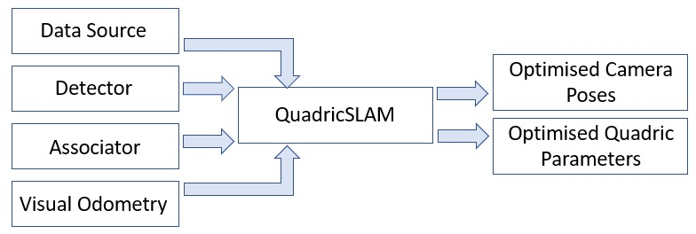
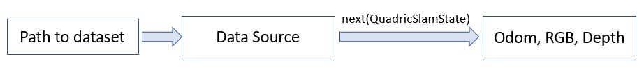
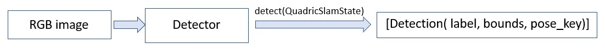
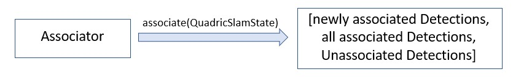
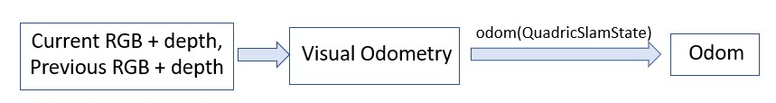
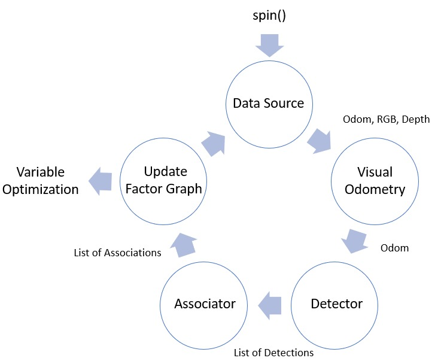
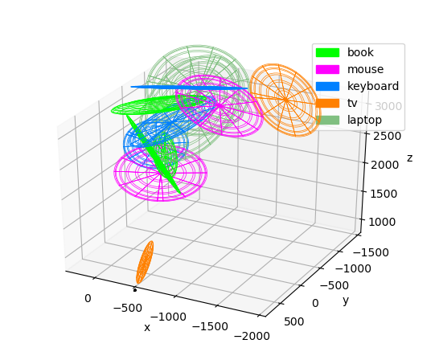

# QuadricSLAM

<b>Figure 1 - QuadricSLAM components</b>

## Data Source

<b>Figure 2 - Data Source</b>

* Used to either access an available dataset or provide the live data to the QuadricSLAM algorithm. The data include odometry, RGB image and depth image. These data is retrived by QuadricSLAM by calling the next() function of data source.
* Depthscaling factor and RGB calibration parameters are also stored here.
* If using a live data, then the configuration of the data source can be defined in the init() function. If using an available dataset, then the path to the dataset is to be passed into here.

## Detector

<b>Figure 3 - Detector</b>

* Used for detecting objects in each RGB image frame. The detect() function outputs the list with elements of type Detection which contains label of the object, list of 4 values of the bounding box(x,y of top-left and bottom-right corners) and the pose_key which indicates at which pose number the current detection is made.
* The default detector used here is the detectron2 FasterRcnn. A pretrained model on certain labels is used here. Only those objects are detected.

## Data Associator

<b>Figure 4 - Data Associator</b>

* Data Associator takes the detections made in the current state and all previously unassosciated detections and used it to compare with previously assosciated detections to decide whether to match the unassosciated detection with a previously assosciated detection(same quadric key to both detection) or to treat the detection as a new object(new quadric key to the detection).
* Basically, it decides whether a detection should be given an existing quadric key or create a new quadric key for it.
* The decision is based on the Intersection Over Union(IOU) value between the detection and an existing quadric. If below a certain threshold, then treated as a new object. Otherwise, assosciated to an existing object.
* In the init() function, we can specify threshold above which an assosciation should be made.
* The associate() function outputs the list of the newly associated detections(objects for which a new quadric has been created in the current step), updated list of associated detections(all objects that has been assosciated with a quadric key), updated list of unassociated detections(objects that doesnt have a quadric key - usually passed as an empty list).

## Visual Odometry

<b>Figure 5 -Visual Odometry</b>

* Could be used to generate the odometry from current and past RGBD image. Usefull when no odometry information is available.
* Here, RgbdOdometry from CV2 library is being used. The current and past RGB images are converted intro gray scale and provided as input along with their depth images to compute the odometry.
* odom() function returns the odometry value.

## QuadricSLAM

* There are two ways to initialize a quadric. initialise_quadric_ray_intersection() and initialise_quadric_from_depth().
* In initialise_quadric_ray_intersection(), the translation and rotation of the poses at which a particular object is seen is used to project rays into 3D space and using least squares method to find the closet converging point which is a good approximation of the quadric centroid. THe initial orientation and size of the quadric is random.
* In initialise_quadric_from_depth(), the quadric can be initialized from a single view or image. To estimate centroid, the z coordinate is calculated as the mean of the depth of points within the bounding box of detection. x and y cordinate are calculated as a calibrated value representing the centre point of the bounding box. The x,y radii of the quadric is calculated as a calibrated value of the height and width of the bounding box. The z radii is assumed to be a predefined object depth of 0.1. The orientation of the quadric can be estimated using the rotation, translation of the camera pose and the quadric centroid through gtsam.PinholeCameraCal3_S2.Lookat() function.
* There are two modes of optimization. Optimization in a batch or in an incremental way. If its set to true, then the optimization of the unknown variables occur only at the end of processing all the images. If false, then the optimization runs along with each detection step.

<b>Figure 6 - spin() function of QuadricSLAM</b>

* THe above figure 6 depicts the main operation of the QuadricSLAM which is the spin() function.
* The next() function of the datasource returns the current odom, RGB and depth.
* If there is no odom data, a visual odometry method could be used to generate the odom data.
* The detector takes in current RGB image and outputs a list of detections with information about the label, bounds and pose_key for each detected object. detect() function is used.
* The associator takes these detections and use IOU method to identify whether its an new object or an existing object in the graph. All the associations and unassociations are outputed by the associate() function.
* Based on the new pose and quadric information, the non linear graph is updated.
* This cycle of process continues untill the dataset is completely processed.
* Based on the optimization batch setting that have been set, the unknown variables are either optimized at the end of processing all the dataset or done in an incremental fashion during each cycle.

<b>Figure 7 - Sample Output</b>

