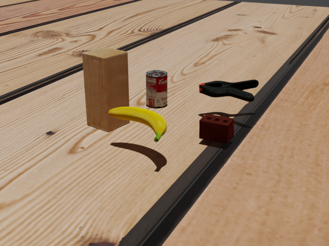
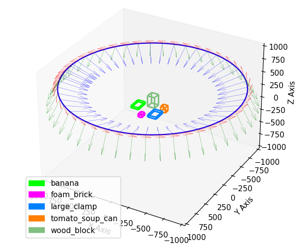
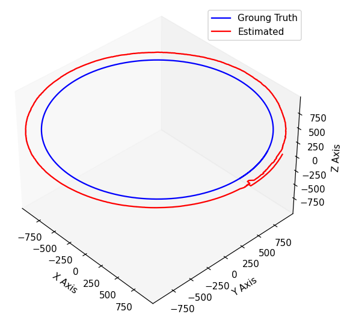
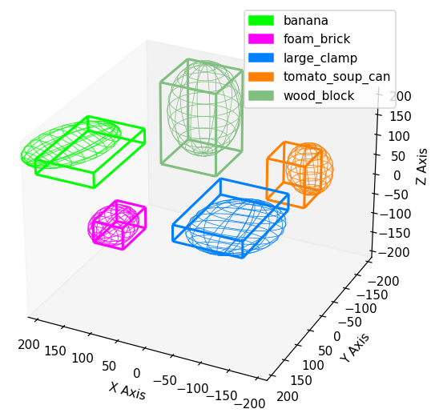
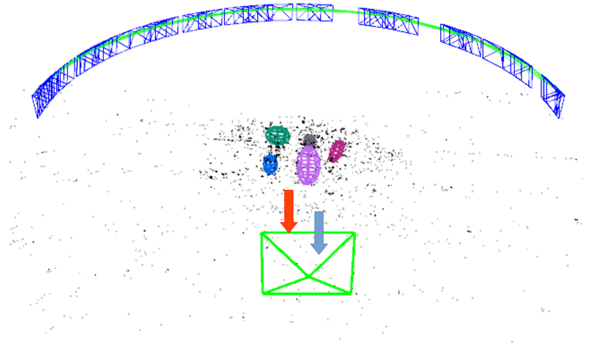

# AllenIsaacRnD


[](./LICENSE)

# Semantic Mapping for Enhanced Localization in Indoor Environments

SLAM is employed to construct an environmental map, incorporating both spatial and semantic data from sensors to facilitate later relocalization. Traditional dense mapping techniques proved impractical for resource-limited mobile robots due to computational and storage constraints, necessitating the use of coarse object models to incorporate semantics into the map. Among these, [**QuadricSLAM**](https://github.com/qcr/quadricslam/tree/master) and [**OA-SLAM**](https://gitlab.inria.fr/tangram/oa-slam) are two notable approaches, with the former requiring an RGBD image as input and the latter using an RGB image. Nevertheless, neither of these methods has been assessed on a common dataset to date. To address this gap, a synthetic dataset was generated, allowing for a quantitative assessment of mapping accuracy using various predefined metrics. The results demonstrate OA-SLAM's accuracy and robustness in the face of sensor noise and its capacity to relocalize with a single RGB image of the scene.

## Research Questions

* What is the performance difference between object only SLAM(QuadricSLAM) and point+object based SLAM(OA-SLAM)? And what all metrics can be used to compare the camera trajectory and the mapped objects?
* Can a synthetic dataset be used to compare the maps of two object oriented SLAMs with the help of ground truth pose and size of the objects?
* What the difference in SLAM methods using either RGB images or RGB-D images?
* Where is the downfall of the 3D point feature based SLAM?
* How much is the storage size of the map that is generated using this SLAM?
* How is the system computation profile while running this SLAM?
* Can these SLAM achieve realtime operation?
* How are the objects being represented as an ellipsoid?
* Is localization improved with semantic abstract modelling of objects as ellipsoids?


## Proposed approach

* The image below shows a sample RGB image of the synthetic scene generated using blender. 5 YCB objects are placed in a scene and the camera moves around this scene. The background texture can also be changed for each scene generated.

<p align="center">
  
</p>

* The ground truth trajectory of the camera and object's position in a scene are plotted using matplotlib. The object's ground truth is represented using a cuboid.

<p align="center">
  
</p>

* The estimated camera trajectory is compared to the ground truth(left image) and the estimated object pose is compared to the ground truth(right image) based on certain metrics. The estimated object is plotted as an ellipsoid.

|  |  |
| :---------------------: | :---------------------: |


* The localization experiment with only half the scene mapped shows ability to relocalize using the object anchors via pnp pose estimation method using a single query RGB image from the unmapped region. Blue arrow is the expected pose and red is the predicted pose along with the green camera frame frustum.

<p align="center">
  
</p>

## Usage

1. Synthetic dataset is to be generated. Follow the instruction in [dataset generation readme](Dataset_generation/README.md) to generate the scene in the BOP format.
2. Create a folder named `./dataset` and add the datasets to the folder. The naming convention of each scene should be `000001, 000002, ...`.
3. Run the file `./OASLAM/utils/rgb_txt_generator.ipynb` to generate `rgb.txt` file in `rgb` folder of each dataset. This file is used by OA-SLAM.
4. Run the file `./OASLAM/utils/detections_json_file_creation.ipynb` to generate the json file from the BOP detections format which is used by OA-SLAM.
5. To run QuadricSLAM on the dataset. Change the `batch_optimization` variable to true or false to control the QuadricSLAM optimzation mode. The output map for the scene is generated at `./dataset/scene_name/quadric_slam_result/`.

  * Run the file `./QuadricSLAM/system_profile_calculation/system_prof_eval_single_dataset.py` to perform QuadricSLAM on a single scene. `data_path` variable needs to be changed to select which scene is to be used.
  * Run the file `./QuadricSLAM/system_profile_calculation/system_prof_eval_all_dataset.py` to perform QuadricSLAM on all scenes in a dataset.
  * In case to run the QuadricSLAM manually, follow below command:
  ```
  python3 <path_to_script> <path_to_dataset> <batch_optimization_mode>
  ```
  ```
  python3 /home/allen/anaconda3/envs/quadricslamtest/lib/python3.10/site-packages/quadricslam_examples/BOP_YCB_dataset_test.py '/home/allen/Desktop/RnD_Github/AllenIsaacRnD/dataset/000001' True
  ```

6. To run OA-SLAM on the dataset. The output map for the scene is generated at `./dataset/scene_name/oa_slam_result/`.

  * Run the file `./OASLAM/system_profile_calculation/system_prof_eval_single_dataset.py` to perform OASLAM on a single scene. `data_path` variable needs to be changed to select which scene is to be used.
  * Run the file `./OASLAM/system_profile_calculation/system_prof_eval_all_dataset.py` to perform OASLAM on all scenes in a dataset.
  * In case to run the OASLAM manually, follow below command:
  ```
  ./oa-slam
      <vocabulary_file>
      <camera_file>
      <path_to_image_sequence (.txt file listing the images or a folder with rgb.txt or 'webcam_id')>
      <detections_file (.json file with detections or .onnx yolov5 weights)>
      <categories_to_ignore_file (file containing the categories to ignore (one category_id per line))>
      <relocalization_mode ('points', 'objects' or 'points+objects')>
      <output_name>
  ```
  ```
  /home/allen/Desktop/OA_SLAM/oaslam/OA-SLAM/bin/oa-slam '/home/allen/Desktop/OA_SLAM/oaslam/OA-SLAM/Vocabulary/ORBvoc.txt' '/home/allen/Desktop/RnD_Github/AllenIsaacRnD/dataset/camera_simulator.yaml' '/home/allen/Desktop/RnD_Github/AllenIsaacRnD/dataset/000001/rgb/' '/home/allen/Desktop/RnD_Github/AllenIsaacRnD/dataset/000001/detections_yolov5.json' 'null' 'points+objects' '000001'
  ```
  
7. To postprocess the generated output map of the QuadricSLAM and to compute the error metrics with respect to ground truth, the file `./QuadricSLAM/output_postprocessing/quadricslam_postprocessing_all_dataset.ipynb` is runned. This is used to generate error metrics file for all the datasets. If we want to visualize the postprocessing one by one and to generate the individual error metrics files, the `QuadricSlam_postprocessing.ipynb` and `Error_estimation.ipynb` file can be runned respectively. The output error metrics files are generated in the `./dataset/scene_name/quadric_slam_result/` folder.

8. To postprocess the generated output map of the OASLAM and to compute the error metrics with respect to ground truth, the file `./OASLAM/output_postprocessing/oaslam_postprocessing_all_dataset.ipynb` is runned. This is used to generate error metrics file for all the datasets. If we want to visualize the postprocessing one by one and to generate the individual error metrics files, the `OASLAM_postprocessing.ipynb` and `Error_estimation.ipynb` file can be runned respectively. The output error metrics files are generated in the `./dataset/scene_name/oa_slam_result/` folder.

9. The comparitive evaluation of a single scene in multiple SLAM methods can be performed by running the `./Comparative_Evaluation/comparison_plots_single_dataset.ipynb`. The comparative evaluation of the same SLAM algorithm in multiple scenes, the file `./Comparative_Evaluation/comparison_plots_all_datasets.ipynb` can be runned.

10. For the noisy bounding box experiment, the file `./Comparative_Evaluation/noisy_bbox_generator/noisy_bbox_generation.ipynb` can be runned to corrupt the `scene_gt_info.json` file in a BOP dataset. Further, `./Comparative_Evaluation/noisy_bbox_generator/detections_json_file_creation.ipynb` can be used to generate the OA-SLAM compatible json file for these noisy ground truth. The aim of the noisy bounding box experiment is to corrupt the existing ground truth bounding boxes generated for the dataset.

11. For the localization experiment using OA-SLAM, delete the name of half set of images in the `rgb.txt` file in the dataset. OA-SLAM process only the images existing in this file. After mapping is done, use the query images from the unused images by editing the `rgb.txt` file in the dataset. Then run the localization script to visualize the reloclization capability.
```
./oa-slam_localization
	<vocabulary_file>
	<camera_file>
	<path_to_image_sequence (.txt file listing the images or a folder with rgb.txt)>
	<detections_file (.json file with detections or .onnx yolov5 weights)>
	<categories_to_ignore_file (file containing the categories to ignore (one category_id per line))>
	<map_file (.yaml)>
	<relocalization_mode ('points', 'objects' or 'points+objects')>
	<output_name>
	<force_relocalization_on_each_frame (0 or 1)>
```
```
/home/allen/Desktop/OA_SLAM/oaslam/OA-SLAM/bin/oa-slam_localization '/home/allen/Desktop/OA_SLAM/oaslam/OA-SLAM/Vocabulary/ORBvoc.txt' '/home/allen/Desktop/RnD_Github/AllenIsaacRnD/dataset/camera_simulator.yaml' '/home/allen/Desktop/RnD_Github/AllenIsaacRnD/dataset/000001/rgb/'  '/home/allen/Desktop/RnD_Github/AllenIsaacRnD/dataset/000001/detections_yolov5.json' null '/home/allen/Desktop/RnD_Github/AllenIsaacRnD/dataset/000001/oa_slam_result/map_000001.yaml' objects 000001_reloc 0
```